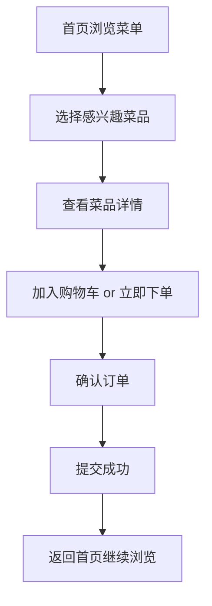
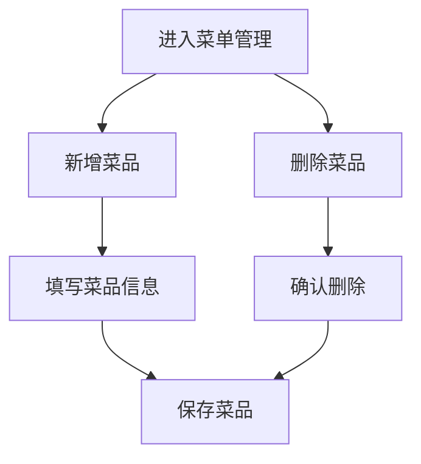

# 家庭菜单 - 产品需求文档

## 1. 产品概述

家庭菜单是一款解决家庭成员每日餐饮决策难题的微信小程序。通过在小程序上下单的方式，家庭成员可以提前选择当日菜品，避免反复沟通的烦恼。

### 目标用户
- 双职工家庭
- 需要协调多方饮食喜好的家庭
- 希望减少"今天吃什么"这类沟通成本的用户

### 核心价值
- 减少家庭成员之间的决策沟通成本
- 提供便捷的菜品浏览和下单体验
- 支持家庭菜单的增删管理

---

## 2. 功能模块

### 2.1 核心功能列表

| 功能 | 描述 | 优先级 |
|------|------|--------|
| 菜单列表展示 | 展示所有可点餐的菜品 | P0 |
| 菜品详情展示 | 查看菜品的完整信息 | P0 |
| 新增菜品 | 添加新菜品到菜单 | P0 |
| 删除菜品 | 从菜单中移除菜品 | P0 |
| 下单菜品 | 选择菜品完成点餐 | P0 |
| 购物车 | 管理已选菜品 | P1 |
| 订单确认 | 确认并提交订单 | P1 |
| 订单历史 | 查看历史订单记录 | P2 |

### 2.2 页面结构

```
首页（菜单列表）
├── 菜品卡片列表
├── 分类筛选
└── 搜索

菜品详情页
├── 菜品图片
├── 菜品名称/价格
├── 菜品描述
├── 加入购物车/立即下单

购物车页
├── 已选菜品列表
├── 数量调整
├── 删除菜品
└── 去结算

订单确认页
├── 订单预览
├── 收货人信息
└── 提交订单

我的页面
├── 订单历史
└── 地址管理
```

---

## 3. 用户流程

### 3.1 主要流程



### 3.2 菜品管理流程



---

## 4. UI 设计规范

### 4.1 设计风格

**风格定位**: iPhone 系统风格、简约白色风（iOS Human Interface Guidelines）

**设计原则**:
- 大量留白，保持呼吸感
- 圆角卡片设计
- 轻微阴影营造层次感
- 简洁的图标和文字

### 4.2 色彩系统

| 用途 | 颜色 | 色值 |
|------|------|------|
| 主色 | 活力橙 | `#FF9500` |
| 主色深 | 深橙 | `#CC7A00` |
| 背景色 | 纯白 | `#FFFFFF` |
| 卡片背景 | 浅灰白 | `#F5F5F7` |
| 文字主色 | 深黑 | `#1D1D1F` |
| 文字次色 | 中灰 | `#86868B` |
| 分割线 | 淡灰 | `#E5E5EA` |
| 成功色 | 绿色 | `#34C759` |
| 警告色 | 红色 | `#FF3B30` |

### 4.3 字体规范

| 用途 | 字体 | 字号 | 字重 |
|------|------|------|------|
| 页面标题 | SF Pro Display | 34px | Bold |
| 卡片标题 | SF Pro Text | 17px | Semibold |
| 正文 | SF Pro Text | 15px | Regular |
| 辅助文字 | SF Pro Text | 13px | Regular |
| 按钮文字 | SF Pro Text | 17px | Semibold |

### 4.4 间距系统

- 页面边距: 16px
- 卡片间距: 12px
- 卡片内边距: 16px
- 按钮高度: 50px
- 圆角: 12px (卡片), 25px (按钮)

### 4.5 页面设计

#### 首页（菜单列表）
- 顶部搜索栏
- 横向分类标签（全部/家常菜/肉类/素菜/汤类/主食）
- 菜品卡片网格（2列）
- 卡片包含：图片、名称、价格、添加按钮
- 底部导航栏

#### 菜品详情页
- 大图展示区（高度200px）
- 菜品名称、分类标签
- 价格显示
- 菜品描述
- 数量选择器
- 底部操作栏（加入购物车、立即购买）

#### 购物车页
- 菜品列表（可修改数量）
- 单项价格计算
- 总价汇总
- 结算按钮

#### 订单确认页
- 订单菜品预览
- 总价显示
- 下单按钮

#### 我的页面
- 用户信息区
- 订单历史入口
- 菜单管理入口

---

## 5. 数据模型

### 5.1 菜品数据

| 字段 | 类型 | 描述 |
|------|------|------|
| id | string | 唯一标识符 |
| name | string | 菜品名称 |
| category | string | 分类 |
| price | number | 价格（元） |
| description | string | 菜品描述 |
| image | string | 图片URL |
| createdAt | number | 创建时间戳 |

### 5.2 购物车项

| 字段 | 类型 | 描述 |
|------|------|------|
| dishId | string | 菜品ID |
| quantity | number | 数量 |
| selectedAt | number | 添加时间戳 |

### 5.3 订单数据

| 字段 | 类型 | 描述 |
|------|------|------|
| id | string | 订单ID |
| items | CartItem[] | 订单项 |
| totalPrice | number | 总价 |
| status | string | 订单状态 |
| createdAt | number | 创建时间 |

---

## 6. 状态说明

### 订单状态
- `pending`: 待处理
- `confirmed`: 已确认
- `completed`: 已完成
- `cancelled`: 已取消

### 菜品分类
- `all`: 全部
- `home`: 家常菜
- `meat`: 肉类
- `vegetable`: 素菜
- `soup`: 汤类
- `staple`: 主食
