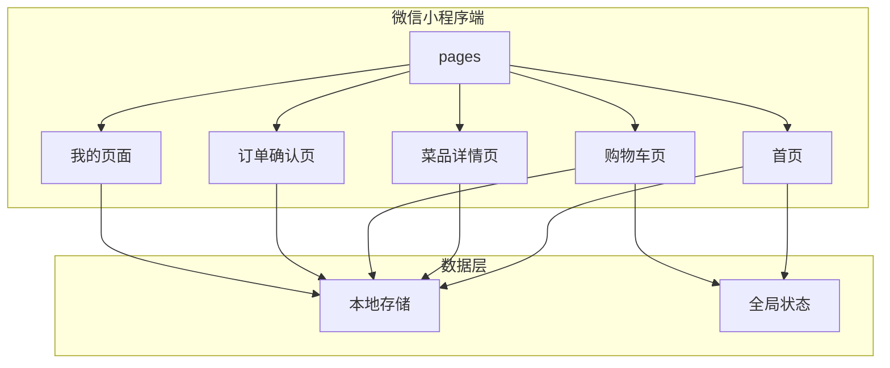

# 家庭菜单 - 技术架构文档

## 1. 架构设计



**说明**:
- 采用微信小程序原生框架
- 使用本地存储（Storage）持久化数据
- 使用 wx-app-job 系统状态管理

---

## 2. 技术选型

### 2.1 前端技术栈

| 技术 | 版本 | 用途 |
|------|------|------|
| 微信小程序框架 | 原生 | 核心框架 |
| JavaScript | ES6+ | 开发语言 |
| WXSS | - | 样式语言 |
| WXML | - | 模板语言 |

### 2.2 数据存储

| 存储方式 | 用途 |
|----------|------|
| wx.setStorageSync | 菜品数据持久化 |
| wx.setStorageSync | 购物车数据持久化 |
| wx.setStorageSync | 订单历史持久化 |

### 2.3 外部资源

| 资源 | 用途 |
|------|------|
| 图标库 | 微信小程序内置 weui-icons |

---

## 3. 项目结构

```
family-menu/
├── app.js                 # 应用入口
├── app.json               # 应用配置
├── app.wxss               # 全局样式
├── pages/                 # 页面目录
│   ├── index/             # 首页（菜单列表）
│   │   ├── index.wxml
│   │   ├── index.js
│   │   ├── index.wxss
│   │   └── index.json
│   ├── detail/            # 菜品详情页
│   │   ├── detail.wxml
│   │   ├── detail.js
│   │   ├── detail.wxss
│   │   └── detail.json
│   ├── cart/              # 购物车页
│   │   ├── cart.wxml
│   │   ├── cart.js
│   │   ├── cart.wxss
│   │   └── cart.json
│   ├── order/             # 订单确认页
│   │   ├── order.wxml
│   │   ├── order.js
│   │   ├── order.wxss
│   │   └── order.json
│   └── mine/              # 我的页面
│       ├── mine.wxml
│       ├── mine.js
│       ├── mine.wxss
│       └── mine.json
├── components/            # 组件目录
│   ├── dish-card/        # 菜品卡片组件
│   └── cart-item/        # 购物车单项组件
├── utils/                # 工具目录
│   ├── storage.js         # 存储工具
│   └── data.js            # 模拟数据
└── styles/               # 样式目录
    └── common.wxss       # 公共样式
```

---

## 4. 页面路由

| 页面 | 路径 | 参数 |
|------|------|------|
| 首页 | /pages/index/index | - |
| 菜品详情 | /pages/detail/detail | id=菜品ID |
| 购物车 | /pages/cart/cart | - |
| 订单确认 | /pages/order/order | - |
| 我的 | /pages/mine/mine | - |

---

## 5. 数据模型

### 5.1 菜品数据

```javascript
{
  id: 'dish_001',
  name: '红烧肉',
  category: 'meat',
  price: 38.00,
  description: '精选五花肉，慢火炖煮，入口即化',
  image: '/assets/images/dish-red-pork.png',
  createdAt: 1640000000000
}
```

### 5.2 购物车项

```javascript
{
  dishId: 'dish_001',
  quantity: 2,
  selectedAt: 1640001000000
}
```

### 5.3 订单数据

```javascript
{
  id: 'order_001',
  items: [
    { dishId: 'dish_001', quantity: 2 },
    { dishId: 'dish_002', quantity: 1 }
  ],
  totalPrice: 86.00,
  status: 'confirmed',
  createdAt: 1640002000000
}
```

---

## 6. API 定义

### 6.1 本地存储 Keys

| Key | 类型 | 描述 |
|-----|------|------|
| dishes | Array | 菜品列表 |
| cart | Array | 购物车 |
| orders | Array | 订单历史 |

### 6.2 全局方法

| 方法 | 参数 | 返回 | 描述 |
|------|------|------|------|
| getApp().getDishes() | - | Array | 获取所有菜品 |
| getApp().addDish(dish) | Object | Boolean | 添加菜品 |
| getApp().deleteDish(id) | String | Boolean | 删除菜品 |
| getApp().getCart() | - | Array | 获取购物车 |
| getApp().addToCart(dishId, qty) | String, Number | Boolean | 添加到购物车 |
| getApp().removeFromCart(dishId) | String | Boolean | 从购物车移除 |
| getApp().createOrder() | - | Order | 创建订单 |

---

## 7. 组件设计

### 7.1 菜品卡片组件 (dish-card)

**属性**:
- `dish`: Object - 菜品数据
- `showAdd`: Boolean - 是否显示添加按钮

**事件**:
- `onAdd`: 点击添加按钮时触发

### 7.2 购物车单项组件 (cart-item)

**属性**:
- `item`: Object - 购物车项
- `dish`: Object - 菜品数据

**事件**:
- `onChange`: 数量变化时触发
- `onDelete`: 删除时触发
